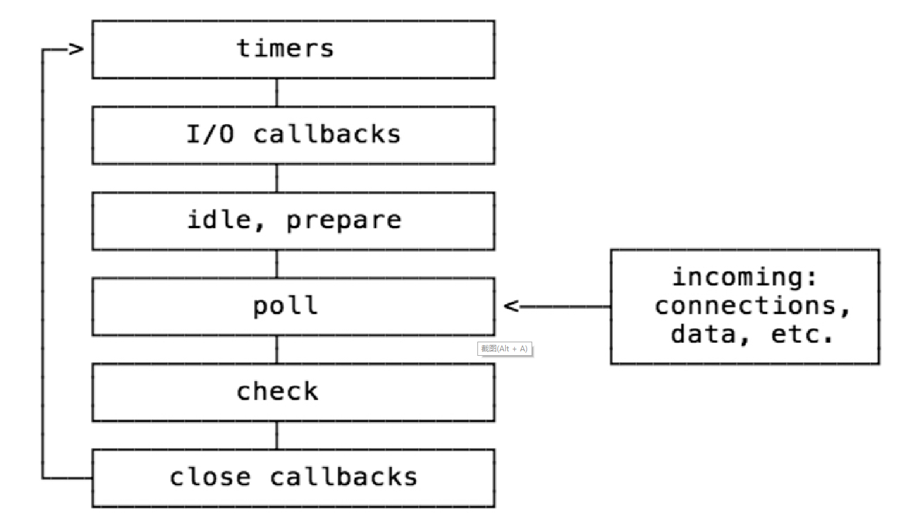

# 事件循环（Event Loop）

事件循环就是程序在执行期间不间断的以某种特定的方式进行的死循环。

事件就是由用户操作产生的，比如元素单击、拖动元素，`ajax`请求、文件读取等，这些事件会按照顺序被加载到一个队列中去。

在客户端，事件循环是由浏览器完成的，而在 `Node` 中，是由 `libuv` 实现的。



`Node` 中的事件循环，共分为6个阶段，每个阶段都维护着一个回调函数的队列。

- `Timers`：用来处理 `setTimeout` 和 `setInterval` 的回调
- `I/O callbacks`：大多数的回调方法都在这个阶段执行，除了 `timers`、`close` 和 `setImmediate`
- `idle, prepare`：内部使用，无需关注
- `Poll`：轮询，不断检查有没有新的IO事件
- `Check`：处理 `setImmediate` 事件回调
- `close callbacks`：处理一些 `close` 相关的事件

## process.nextTick

`process.nextTick` 就是定义一个异步动作，并让这个动作在事件循环当前阶段结束后执行。

```js
process.nextTick(function() {
  console.log('first');
})
console.log('next');
// next
// first
```

`process.nextTick` 并不是事件循环的一部分，但它的回调方法是由事件循环调用的。该方法会把回调加入到一个 `nextTickQueue` 的队列中，在事件循环的任何阶段，如果 `nextTickQueue` 队列不为空，那么就会在当前阶段操作完成后优先执行该队列中的回调函数，当 `nextTickQueue` 队列中的回调执行完毕后，事件循环才会继续向下执行。

## nextTick与setImmediate

`setImmediate` 是 `Node` 提出的新方法，它同样会将回调函数加入到事件队列中，不同于 `setTimeout` 和 `setInterval` ，`setImmediate` 并不接受一个事件作为参数，而是在当前事件循环的结尾触发。

`setImmediate` 与 `nextTick` 很相似，由于 `process.nextTick` 总是在当前操作完成后立即执行，所以，它总会在 `setImmediate` 之前被执行。

```js
setImmediate(function(arg) {
  console.log('executing immediate', arg);
}， 'so immediate')
process.nextTick(function() {
  console.log('next tick');
})

// next tick
// executing immediate: so immediate
```

## setImmediate和setTimeout

`setImmediate` 方法会在 `poll` 阶段结束后执行，而 `setTimeout` 会在规定的事件到期后执行，所以如果把两者放在一个IO操作的 `callbacks` 中，则永远是 `setImmediate` 先执行。

```js
setTimeout(function() {
  console.log('timeout');
}, 0);
setImmediate(function() {
  console.log('immediate');
});
// immediate
// timeout
```

在 `readFile` 方法中，事件循环位于 `poll` 阶段，因此事件循环会先进入 `check` 阶段执行 `setImmediate` 的回调，然后再进入 `timers` 阶段执行 `setTimeout` 的回调。

```js
require('fs').readFile('foo.txt', function() {
  setTimeout(function() {
    console.log('timeout');
  }, 0);

  setImmediate(function() {
    console.log('immediate');
  })
})
```
