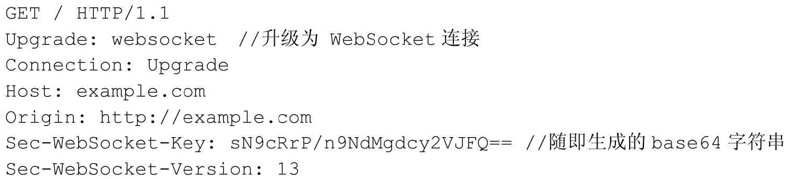
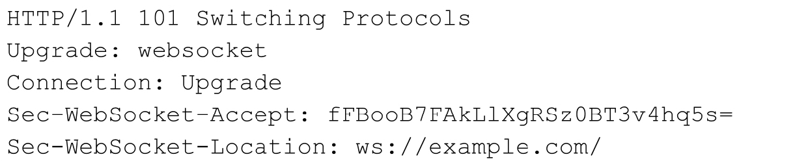

# WebSocket

WebSocket可以看做是HTTP的升级版，它主要是为了弥补HTTP协议无法持久化和无状态而诞生的。

WebSocket提供了客户端和服务端之间全双工的通信机制。

## 保持通话

HTTP非持久化，当客户端发起 `request` 时，服务器会返回一个 `response`，那么HTTP连接就结束了，TCP也随之关闭，如果想要继续访问服务器就必须重新发起连接。

为了改进，HTTP1.1在请求头中增加了 `Connection: Keep-Alive` 字段，当服务器接受到这个字段后，会保持TCP连接不断开，同时，`response` 中也会增加这一字段，这样，客户端和服务器端就可以只建立一次连接而进行多次HTTP通信了。

这个属性已被加入到标准之中，除非指定 `close` ，为了避免无限制的长连接，服务器也会设置一个 `timeout` 属性，用来指定该长连接可以保持的最长时间。

`Keep-Alive` 解决了因为多次的TCP握手带来的性能损耗，但它没有从根本上解决实时通信的问题。

## WebSocket的意义

`WebSocket` 就是为了解决实时通信的问题而生的。请求不再只由客户端发起，服务器端可以主动推送消息给客户端。

客户端发送 `WebSocket` 的请求头如下：



服务器端返回消息如下：



在请求头中，`Connection` 字段必须设置成 `Upgrade`，表示客户端希望升级连接。 `Upgrade` 字段设置成 `WebSocket`，表示希望升级到 `WebSocket` 协议。

`Sec-WebSocket-Key` 是一串随机字符串，服务器端会用这些数据构造出一个SHA-1的信息摘要。

`Sec-WebSocket-Version` 表示支持的 `WebSocket` 版本。

## 在Node中使用WebSocket

在Node中，由很多支持 `WebSocket` 的三方模块，其中 `WS` 就是其中之一。

```js
// JavaScript 连接到WebSocket
var ws = new WebSocket('ws://localhost:3004');
ws.onopen = function() {
  ws.send('Hello');
}
ws.onmessage = function(msg) {
  console.log(msg.data);
}

// Node实现WebSocket
var WebSocketServer = require('ws').Server;
var wss = new WebSocketServer({ port: 3004 });
wss.on('connection', function(ws) {
  ws.on('message', function(message) {
    console.log('recevied: %s', message);
  });
  ws.send('I am a message sent from a ws server!');
})
```

在Node中，比较出名的 `WebSocket` 模块还有 `Socket.IO`，常被用来做在线聊天或推送服务等。